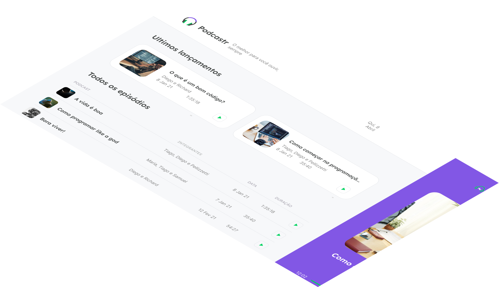
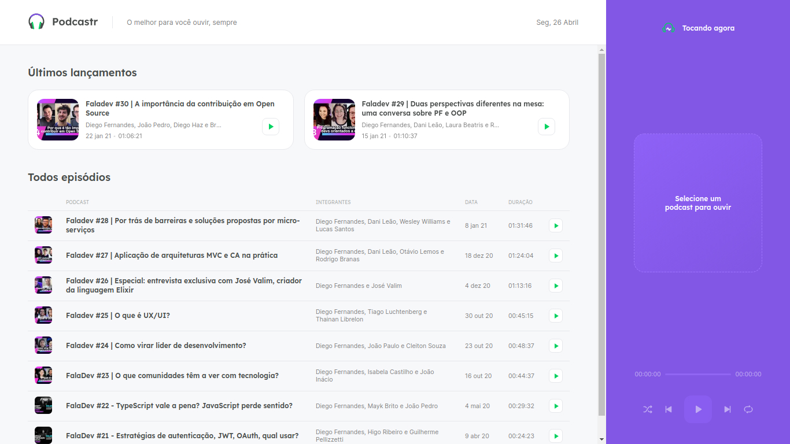

<h1 align="center">
  
</h1>

<p align="center">
 

  

  

  <br>
  <br>
  <br>
  <br>

  
</p>

<br>
<br>
<br>
<br>

<h1 align="center">
  <strong>💻 Projeto</strong>
</h1>

<p>
  O Podcastr te ajuda a encontrar os melhores podcasts sobre tecnologia para você.

  <br>
  <br>
  
  <br>
  <br>

  Por enquanto apenas podcasts da <strong>[Rocketseat](https://www.youtube.com/channel/UCSfwM5u0Kce6Cce8_S72olg)</strong> foram integrados, caso queiram integrar mais podcasts façam um pull request

  <br>
  <br>
  <small>O Podcastr foi desenvolvido durante a <a src="https://nextlevelweek.com/"><strong>Next Level Week</strong></a>, apresentado pela <a src="https://github.com/Rocketseat"><strong>@Rocketseat</strong></a> durante os dias 19 - 25 de abril</small>
</p>

<br>
<br>

<h1 align="center">
  🧪 <strong>Tecnologias</strong>
</h1>

<p>
  esse projeto foi desenvolvido com as seguintes tecnologias:

  - [Node.js](https://nodejs.org/en/)
  - [React](https://reactjs.org)
  - [Next.js](https://nextjs.org/)
  - [Scss](https://sass-lang.com/)
  - [Typescript](https://www.typescriptlang.org/)
</p>

<br>
<br>

<h1 align="center">
  <strong>🔖 Layout</strong>
</h1>

<p>
  Veja o layout desse projeto no figma.

  - [Podcastr Web](https://www.figma.com/file/F0g1TtbiyE9HM6n2g0Jezf/Podcastr?node-id=160%3A2761)

  Você precisa ter uma conta do [Figma](http://figma.com) para ter acesso.
</p>

<br>
<br>

<h1 align="center">
  <strong>📝 Licensa</strong>
</h1>

<p>
  <small>Esse projeto está sobre a licensa do MIT.
  Veja a [Licensa](LICENSE.md) para mais detalhes.</small>
</p>

<br>
<br>

<h1 align="center">
  <strong>🚀 Getting Started</strong>
</h1>

<p>
  <strong>Clone o projeto</strong>

  ```bash
  git clone https://github.com/VitorGouveia/Podcastr.git
  ```

  <br>

  <strong>Acesse a pasta</strong>

  ```bash
  cd podcastr
  ```

  <br>
  <br>

  <strong>Siga os passos a seguir</strong>

  ```bash
  # Instale as dependências
  npm i

  # Inicie o JSON server
  npm run server

  # Inicie o app
  npm run dev

  # ou

  # Instale as dependências
  yarn

  # Inicie o JSON server
  yarn server

  # Inicie o servidor de desenvolvimento
  yarn dev
  ```

  <br>
  <br>

  <strong>Crie a build do projeto</strong>

  ```bash
  npm run build

  #ou

  yarn build

  # inicie o servidor

  npm start

  #ou

  yarn start
  ```
</p>
